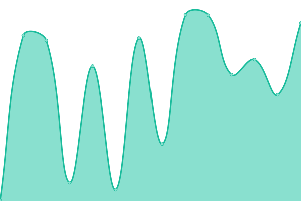

# [📈 Live Status](https://status.m0r016.net): <!--live status--> **🟧 部分的な停止**

<!--start: status pages-->
<!-- This summary is generated by Upptime (https://github.com/upptime/upptime) -->
<!-- Do not edit this manually, your changes will be overwritten -->
<!-- prettier-ignore -->
| URL | 状態 | 履歴 | 応答時間 | 稼働時間 |
| --- | ------ | ------- | ------------- | ------ |
|  [Blog](https://blog.m0r016.net) | 🟥 停止 | [blog.yml](https://github.com/m0r016/status/commits/HEAD/history/blog.yml) | 

 130ミリ秒
     
 | 

<a href="https://status.m0r016.net/history/blog">98.25%</a>
    

|  [Portfolio](https://identity.m0r016.net) | 🟥 停止 | [portfolio.yml](https://github.com/m0r016/status/commits/HEAD/history/portfolio.yml) | 

 115ミリ秒
     
 | 

<a href="https://status.m0r016.net/history/portfolio">98.25%</a>
    

|  [mstdn.life](https://mstdn.life) | 🟩 正常 | [mstdn-life.yml](https://github.com/m0r016/status/commits/HEAD/history/mstdn-life.yml) | 

 729ミリ秒
     
 | 

<a href="https://status.m0r016.net/history/mstdn-life">99.33%</a>
    

|  [Pleroma](https://wut.m0r016.net) | 🟥 停止 | [pleroma.yml](https://github.com/m0r016/status/commits/HEAD/history/pleroma.yml) | 

 388ミリ秒
     
 | 

<a href="https://status.m0r016.net/history/pleroma">98.25%</a>
    

|  [Tere-Zombie](https://mstdn.tentere.net) | 🟩 正常 | [tere-zombie.yml](https://github.com/m0r016/status/commits/HEAD/history/tere-zombie.yml) | 

 709ミリ秒
     
 | 

<a href="https://status.m0r016.net/history/tere-zombie">98.83%</a>
    

|  [Object Storage (Minio)](https://s3-console.m0r016.net) | 🟥 停止 | [object-storage-minio.yml](https://github.com/m0r016/status/commits/HEAD/history/object-storage-minio.yml) | 

 382ミリ秒
     
 | 

<a href="https://status.m0r016.net/history/object-storage-minio">98.25%</a>
    

|  [Upptime](https://status.m0r016.net) | 🟥 停止 | [upptime.yml](https://github.com/m0r016/status/commits/HEAD/history/upptime.yml) | 

 130ミリ秒
     
 | 

<a href="https://status.m0r016.net/history/upptime">98.25%</a>
    

<!--end: status pages-->

[**Visit our status website →**](https://status.m0r016.net)

## 📄 License

- Powered by: [Upptime](https://github.com/upptime/upptime)
- Code: [MIT](./LICENSE) © [もろ](https://www.m0r016.net)
- Data in the `./history` directory: [Open Database License](https://opendatacommons.org/licenses/odbl/1-0/)
