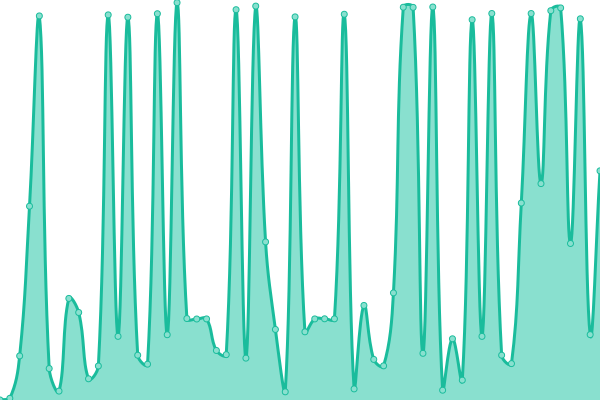
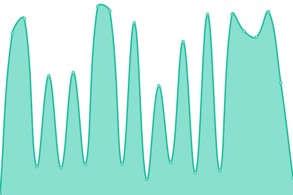

# [📈 Live Status](https://status.m0r016.net): <!--live status--> **🟩 すべてのシステムは正常に稼働**

<!--start: status pages-->
<!-- This summary is generated by Upptime (https://github.com/upptime/upptime) -->
<!-- Do not edit this manually, your changes will be overwritten -->
<!-- prettier-ignore -->
| URL | 状態 | 履歴 | 応答時間 | 稼働時間 |
| --- | ------ | ------- | ------------- | ------ |
|  [Home](https://www.m0r016.net) | 🟩 正常 | [home.yml](https://github.com/m0r016/status/commits/HEAD/history/home.yml) | 

 291ミリ秒
     
 | 

<a href="https://status.m0r016.net/history/home">100.00%</a>
    

|  [Blog](https://blog.m0r016.net) | 🟩 正常 | [blog.yml](https://github.com/m0r016/status/commits/HEAD/history/blog.yml) | 

 139ミリ秒
     
 | 

<a href="https://status.m0r016.net/history/blog">100.00%</a>
    

|  [Portfolio](https://identity.m0r016.net) | 🟩 正常 | [portfolio.yml](https://github.com/m0r016/status/commits/HEAD/history/portfolio.yml) | 

 174ミリ秒
     
 | 

<a href="https://status.m0r016.net/history/portfolio">99.33%</a>
    

|  [slum.cloud](https://slum.cloud) | 🟩 正常 | [slum-cloud.yml](https://github.com/m0r016/status/commits/HEAD/history/slum-cloud.yml) | 

 601ミリ秒
     
 | 

<a href="https://status.m0r016.net/history/slum-cloud">100.00%</a>
    

|  [Pleroma](https://wut.m0r016.net) | 🟩 正常 | [pleroma.yml](https://github.com/m0r016/status/commits/HEAD/history/pleroma.yml) | 

 2907ミリ秒
     
 | 

<a href="https://status.m0r016.net/history/pleroma">28.62%</a>
    

|  [Tere-Zombie](https://mstdn.tentere.net) | 🟩 正常 | [tere-zombie.yml](https://github.com/m0r016/status/commits/HEAD/history/tere-zombie.yml) | 

 927ミリ秒
     
 | 

<a href="https://status.m0r016.net/history/tere-zombie">100.00%</a>
    

|  [Object Storage (Minio)](https://s3-console.m0r016.net) | 🟩 正常 | [object-storage-minio.yml](https://github.com/m0r016/status/commits/HEAD/history/object-storage-minio.yml) | 

 510ミリ秒
     
 | 

<a href="https://status.m0r016.net/history/object-storage-minio">100.00%</a>
    

|  [anx.slum.cloud](https://anx.slum.cloud) | 🟩 正常 | [anx-slum-cloud.yml](https://github.com/m0r016/status/commits/HEAD/history/anx-slum-cloud.yml) | 

 610ミリ秒
     
 | 

<a href="https://status.m0r016.net/history/anx-slum-cloud">100.00%</a>
    

|  [Upptime](https://status.m0r016.net) | 🟩 正常 | [upptime.yml](https://github.com/m0r016/status/commits/HEAD/history/upptime.yml) | 

 152ミリ秒
     
 | 

<a href="https://status.m0r016.net/history/upptime">100.00%</a>
    

<!--end: status pages-->

[**Visit our status website →**](https://status.m0r016.net)

## 📄 License

- Powered by: [Upptime](https://github.com/upptime/upptime)
- Code: [MIT](./LICENSE) © [もろ](https://www.m0r016.net)
- Data in the `./history` directory: [Open Database License](https://opendatacommons.org/licenses/odbl/1-0/)
